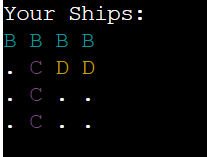

# **Battleships Game**

Immerse yourself in the classic strategy game of Battleships, where you strategically position your fleet and attempt to sink your opponent's ships before they sink yours.
This game was created as a portfolio project to showcase my current Python skills.
[A live version of the project can be viewed here](https://battleship-game88-7a782ff23f3b.herokuapp.com/).

## Table of Contents

1. [**Battleship**](#battleships-game)
   * [How to Play](#how-to-play)
     * [Setup](#setting-up-the-game)
     * [Taking turns](#taking-turns)
     * [Winning the Game](#winning-the-game)
     * [Exiting the Game](#exiting-the-game)
   * [Ships types and sizes](#ship-types-and-sizes)
2. [**User Experience (UX)**](#user-experience-ux)
   * [User Stories](#user-stories)
3. [**Features**](#game-features)
   * [Features Left to Implement](#features-left-to-implement)
4. [**Technologies and Libraries Used**](#technologies-and-libraries-used)
5. [**Testing**](#testing)
   * [Testing during development](#testing-during-development)
   * [Bugs Found](#bugs-found)
   * [Functional Testing](#functional-testing)
   * [Validator Testing](#validator-testing)
6. [**Deployment**](#deployment)
   * [Version Control](#version-control)
   * [To deploy to Heroku terminal](#to-deploy-to-heroku-terminal)
   * [Clone the Repository Code from github desktop](#clone-the-repository-code-from-github-desktop)
7. [**Credits**](#credits)

## Game Features

* Colorful terminal-based interface with ASCII art.
* Interactive gameplay against a computer opponent.
* Customizable grid sizes, ranging from 4x4 to 10x10.
* Three types of ships: Battleship, Cruiser, and Destroyer.
* The ability to exit the game at any point by entering "exit" or "quit".

## How to Play

### Setting Up the Game

Run the game and choose a grid size, which can range from 4x4 to 10x10.
Place your ships on the grid. You will be prompted to position each type of ship and choose an orientation (horizontal or vertical).

### Taking Turns

Players take turns guessing the positions of the opponent's ships on the grid.
Enter your shot's coordinates when prompted. For instance, "A 1".
A 'Hit' is marked with an 'X', and a 'Miss' is marked with an 'O'.

### Winning the Game

The game continues until all ships of one player are sunk.
If you sink all the computer's ships first, you win! But if the computer sinks all your ships first, you lose.

### Exiting the Game

You can exit the game at any point by entering "exit" or "quit" when prompted for input.

## Ship Types and Sizes

* **Battleship:** 4 spaces, represented by a Cyan 'B'.
* **Cruiser:** 3 spaces, represented by a Magenta 'C'.
* **Destroyer:** 2 spaces, represented by a Yellow 'D'.

## User Experience (UX)

### User Stories

* As a player, I want to start a new game so that I can enjoy the Battleships experience from the beginning.

* As a player, I want to select the grid size (ranging from 4x4 to 10x10) so that I can choose the complexity and duration of the game.

* As a player, I want to manually place my ships on the grid so that I can strategize the best positions to defend against the computer.

* As a player, I want to take turns with the computer guessing ship positions so that I can engage in a competitive match to sink the opponent's fleet.

* As a player, I want to receive visual feedback (like 'Hit' or 'Miss') after each turn so that I can adjust my strategy based on the game's progress.

* As a player, I want to be notified when all ships of one side are sunk so that I can know if I've won or lost the game.

* As a player, I want the option to exit the game at any point so that I can leave the game when needed without having to finish the match.

## Features

**ASCII Art Title:**

The game showcases the title "Battleships" in ASCII art at the start, offering an immersive and retro feel to the game.

**Interactive Grid Setup:**

Players can select the size of the grid they want to play on, ranging from 4x4 to 10x10.

**Colorful Terminal Interface:**

Utilizes the colorama library to display ships and game feedback in various colors, enhancing the visual experience.

**Different Ship Types:**

The game features three types of ships, each with its own size and icon:

* Battleship: 4 spaces
* Cruiser: 3 spaces
* Destroyer: 2 spaces

**Manual Ship Placement:**

Players are prompted to manually place their ships on the grid, allowing them to strategize their ship's positions.

**Computer Opponent:**

Players compete against a computer opponent that places ships and takes shots randomly.

**Turn-based Gameplay:**

The game progresses in turns, with the player and the computer alternately guessing ship positions.

**Visual Feedback on Hits and Misses:**

When a shot is taken, the game provides visual feedback on whether it's a hit or miss. Hits are marked with a red 'X' and misses with 'O'.

**Endgame Notifications:**

The game notifies the player when all ships of one side are sunk, declaring either a victory or a defeat.

**Repeatability:**

After a game concludes, players are given the option to restart and play again.

**Exit Command:**
Players can type "exit" or "quit" at any point during the game to immediately exit the game.

**Instructions Display:**
The game provides clear instructions at the start, explaining the gameplay, ship identification, and objectives.

**Example Grid Display:**
Before starting the game, players are shown an example of a 10x10 grid to familiarize themselves with the layout.

### Features Left to Implement

* Multiplayer option for the game.
* Option to choose whether to input rows and columns or coordinates in the format A 1 H according to the player's preference.
* Keeping scores for the player and computer.

## Technologies and Libraries Used

* Python was used as the programming language to code the game logic.
* [LucidChart](https://www.lucidchart.com/pages/) was used to create the flow chart for control flow. The flow of the game was laid out and structured to aid in the design of the control flow statements such as if-elif-else statements, while loops and for loops.
The actual flowchart can be viewed [here](https://lucid.app/lucidchart/5a98654e-3632-449f-ade4-5b3b26d5ffa5/edit?view_items=2T-DNyjDVaOZ&invitationId=inv_362ba325-d51e-4ff5-a62a-0d209905b1e0).

    

* [Colorama](https://pypi.org/project/colorama/) was installed and imported for adding color to text to make it easier to read.
* [Pyfiglet](https://pypi.org/project/pyfiglet/0.7/) was installed and imported for adding ascii art to the game title.
* [GoogleDocs](https://docs.google.com/document/u/0/) was used to create an online spreadsheet to write down testing results.
* [GitHub](https://github.com/) has been used to store the code, images, and other content related to the project.
* [Heroku](https://dashboard.heroku.com/apps) was used to deploy the game on the web.
* [Git](https://git-scm.com/) was used to commit and push code during the development stage.
* [Visual Studio Code](https://code.visualstudio.com/) was used as an IDE.

## Testing

### Testing during development

* Continuous testing was carried out throughout the development stage and even after deployment on Heroku. The whole project was broken into functions. Each function was checked with PEP8 standard before moving to the next one.
* [FlowChart](https://lucid.app/lucidchart/invitations/accept/inv_784b90d4-5035-47fc-a4f8-026dd960e23b) used before the development of the game. It was used to help creating the game logic and visualizing the flow of the game for ease of development.
* `print()`and `type()` were used during the development process, to help identify possible errors and bugs.
* All the prompts to the user were tested manually.

### Bugs Found

* The player is not told whether they sunk a ship or not, or which ship they sunk.

### Functional Testing

After the game was deployed on Heroku at the end of the development stage, a dedicated manual testing was carried out as a user at Heroku terminal. Each input option was tested with all the possible scenarios and particular attention was paid to validating the value of the input. The player's board as well as the computer's board were closely monitored to check if any changes were made as a consequence of the guesses made on each round.
Using the words exit/quit was tested manually on all input prompts to the player.

Here are the results:

### Validator Testing

[CI Python Linter](https://pep8ci.herokuapp.com/) was used for validating the python files.  No errors reported.

## Deployment

[A live version of the project can be viewed here](https://battleship-game88-7a782ff23f3b.herokuapp.com/).

### Version Control

* Git was used as the version control software. Commands such as git add ., git status, git commit and git push were used to add, save, stage and push the code to the GitHub repository where the source code is stored.

### To deploy to Heroku terminal

The site was deployed via [Heroku](https://id.heroku.com/login).
This project was developed utilizing the [Code Institute Template](https://github.com/Code-Institute-Org/p3-template).

`pip3 freeze > requirements.txt` was used to add pyfiglet and Colorama imports to Heroku for deployment.

The below steps were followed to deploy this project to Heroku:

1. Go to [Heroku](https://dashboard.heroku.com/apps) and click "New" to create a new app.
2. Enter your App name, set the region, and press "Create App".
3. Go to "Settings" and navigate to Config Vars. Add first Config Var with a key word of 'PORT' and a value of '8000'.
4. Still in the "Settings", navigate to Buildpacks and add buildpacks for Python and then NodeJS (must in this order).
5. Leave "Settings" and go to "Deploy". Scroll down and set Deployment Method to GitHub. Once GitHub is chosen, find your repository and connect it to Heroku.
6. Scroll to the bottom of the deploy page and select preferred deployment type:
    * Click **Enable Automatic Deploys** for automatic deployment when you push updates to Github.
    * Further down to **Manual Deploy**, make sure the "main" branch is selected and click "Deploy Branch".
7. The game's live link can be found [here](https://client-profile-system.herokuapp.com/).

### Clone the Repository Code from github desktop

Navigate to the GitHub Repository you want to clone to use locally:

* Click on the code drop down button
* Click on HTTPS
* Copy the repository link to the clipboard
* Open your IDE of choice (git must be installed for the next steps)
* Type git clone copied-git-url into the IDE terminal
* The project will now been cloned on your local machine for use.

## Acknowledgements

I would like to acknowledge the absolutely amazing mentor Daisy McGirr. After checking my original code, she introduced me to the appropriate technologies and libraries to enhance the game's look and functionality.
To Daniel Ahlberg for helping me and putting up with the stress this project was causing me.
To Lucas Alenbro Lindström for helping me debug and giving me great ideas to implement.

## Credits

**Resources used to implement specific features:**

* [How to use Colorama in Python](https://pypi.org/project/colorama/)
* [Python | ASCII art using pyfiglet module](https://www.geeksforgeeks.org/python-ascii-art-using-pyfiglet-module/)

**Resources that helped fix issues/errors in the code:**

* [How can I split up a long f-string in Python?](https://stackoverflow.com/questions/48881196/how-can-i-split-up-a-long-f-string-in-python)
* [Breaking up long lines of code in Python](https://www.pythonmorsels.com/breaking-long-lines-code-python/)
* [What Does if `__name__ == "__main__"` Do in Python? – Real Python](https://realpython.com/if-name-main-python/)
